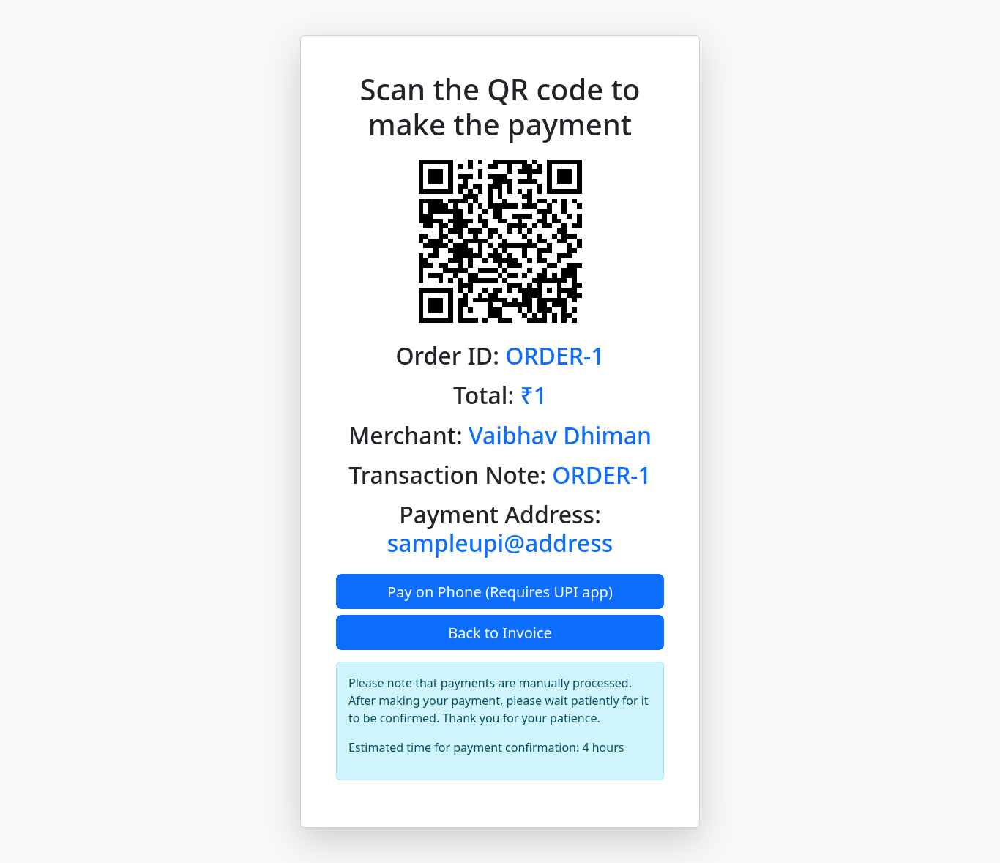
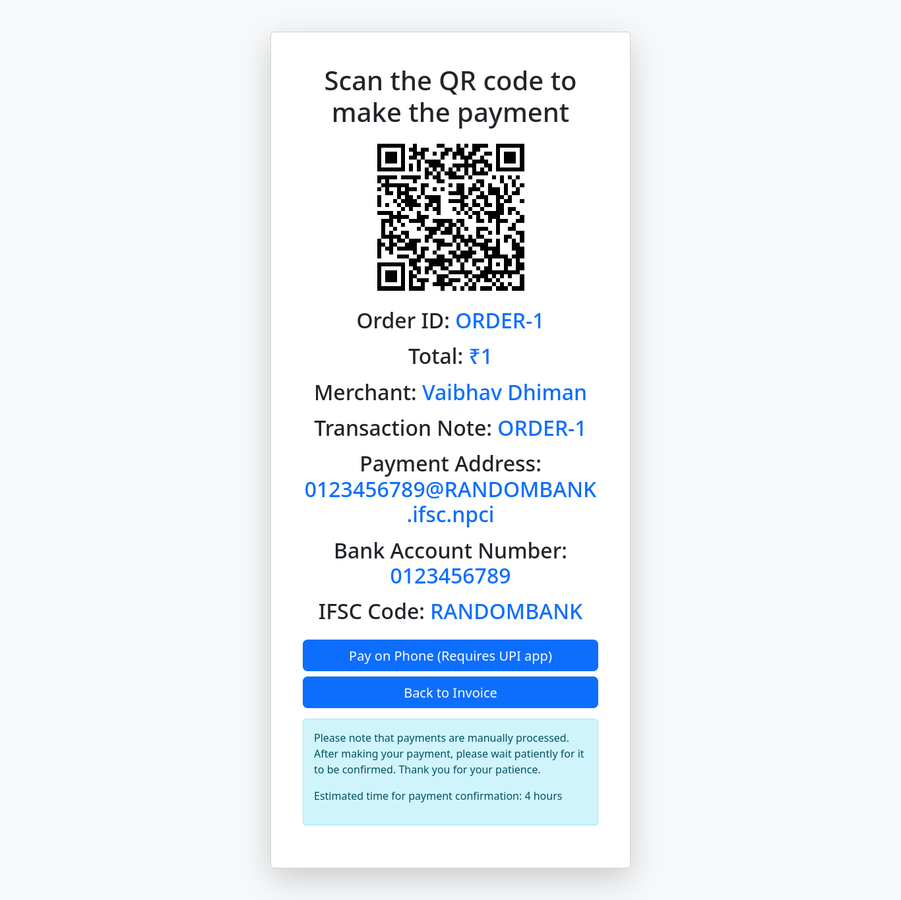
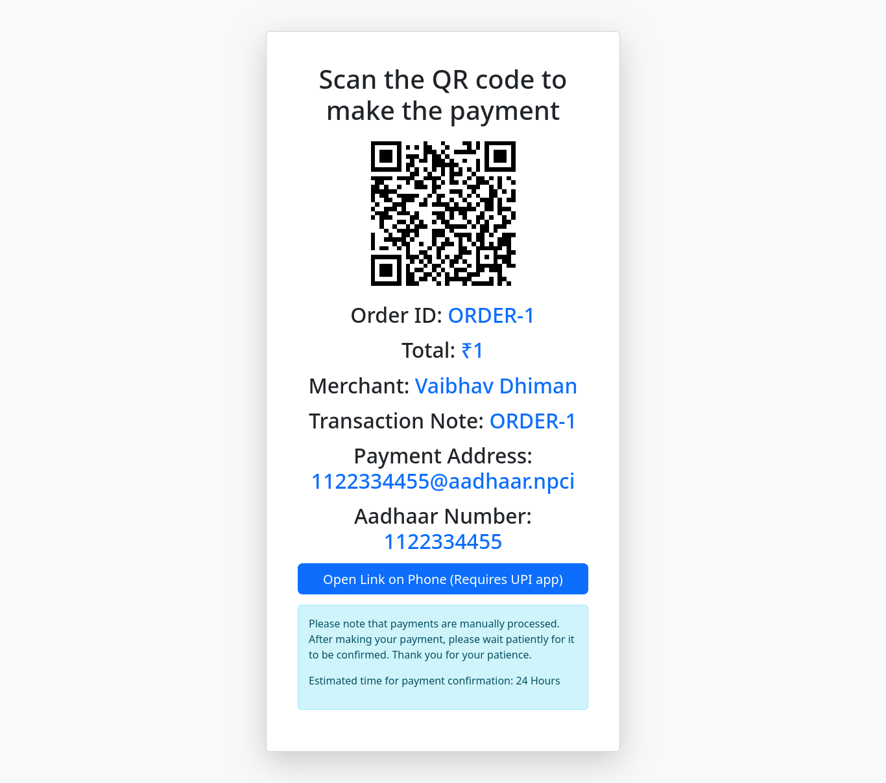
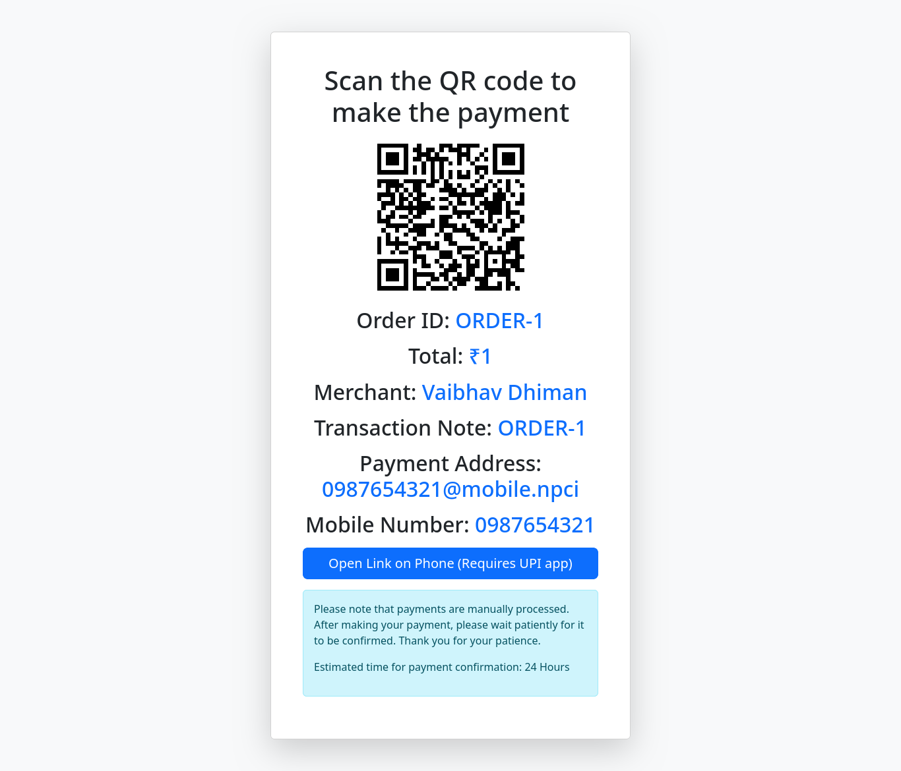
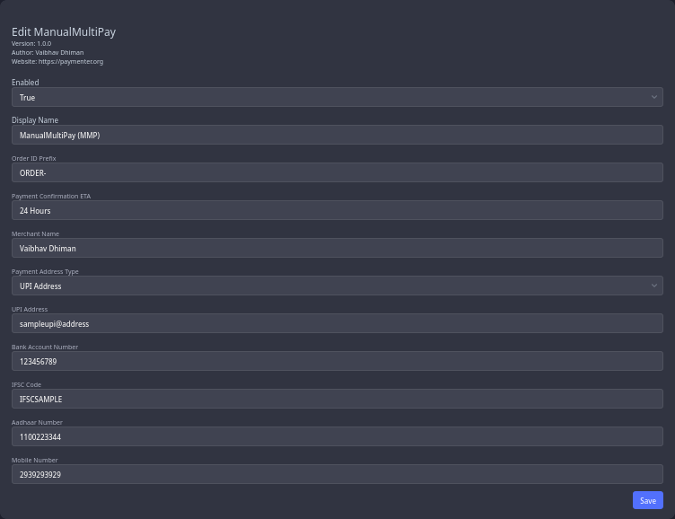

# ManualMultiPay (MMP) Gateway Extension

> - Supported Version: Paymenter V1 Beta
> - Extension Version: v2.0.0

ManualMultiPay (MMP) is a gateway extension for Paymenter, an open-source hosting automation system. It enables you to accept payments through multiple methods, which are:

- UPI Address
- Bank Account
- Aadhaar Number
- Mobile Number

## Features & Functionality:

- Displays a QR code and payment details for easy transactions.
- Provides a one-click payment button to open the user's payment app with pre-filled details.
- Supports payments in **INR** via UPI Address, Bank Account, Aadhaar Number, and Mobile Number.
- Automatically adds the order ID as a transaction note for payment tracking which makes it easier to ensure that everything is processed correctly.

> The extension **does not** handle payment confirmation or invoice marking. After a user makes a payment, you must manually confirm that the payment has been made and mark the invoice as paid. This extension is designed to facilitate the payment process, but the confirmation and invoice marking processes are still your responsibility.

Sample Screenshots

UPI Payment:

Bank Account Payment:

Aadhaar Payment:

Mobile Payment:

## Getting Started
1. Install the extension
 - Replace `/var/www/paymenter` with your paymenter root if it is different
 - **One-liner Install:** `git clone https://github.com/VaibhavSys/ManualMultiPay.git /var/www/paymenter/extensions/Gateways/ManualMultiPay`
 - **Manual Install:** [Download](https://github.com/VaibhavSys/ManualMultiPay/releases/latest/download/ManualMultiPay.zip) the extension and extract it in `/var/www/paymenter/extensions/Gateways`
2. Enable the extension
3. Set the Merchant Name (Payee Name)
4. Select the Payment Address Type (UPI Address, Bank Account Number, Aadhaar Number, Mobile Number)
5. Fill the relevant payment address field and set the unused payment address fields to NA.
6. Set an order ID prefix (optional)
7. Set a payment confirmation ETA which will be shown to the user (optional)
8. Done! You are ready to accept payments.

## Settings
- If you are not using the required payment information fields, you can set them to NA.
- **Order ID Prefix (optional):** This is added before the order ID.
- **Payment Confirmation ETA (optional):** Estimated time for payment confirmation (eg- 24 Hours).
- **Merchant Name:** Name of the Merchant/Payee.
- **Payment Address Type:** The payment address on which you want to receive payments. Available Options- UPI Address, Bank Account Number, Aadhaar Number, Mobile Number.
- **Allow Foreign Currency:** Enable this option to allow users to pay invoices in non-INR currencies. The invoice amount will be considered equivalent to the INR amount.
- **UPI Address:** The UPI Address which will be used for receiving payments.
- **Bank Account Number:** The Bank Account Number which will be used for receiving payments.
- **IFSC Code:** IFSC code of the bank account mentioned above.
- **Aadhaar Number:** Aadhaar Number which will be used for receiving payments.
- **Mobile Number:** Mobile Number which will be used for receiving payments.

## Additional Information
This project is licensed under the terms of the MIT license. For more details, see the [LICENSE](LICENSE) file in the repository.

The source code for this project is available on GitHub. You can access it [here](https://github.com/VaibhavSys/ManualMultiPay).